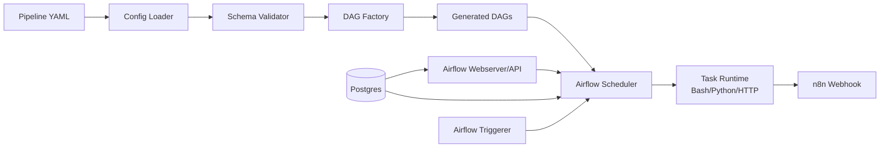
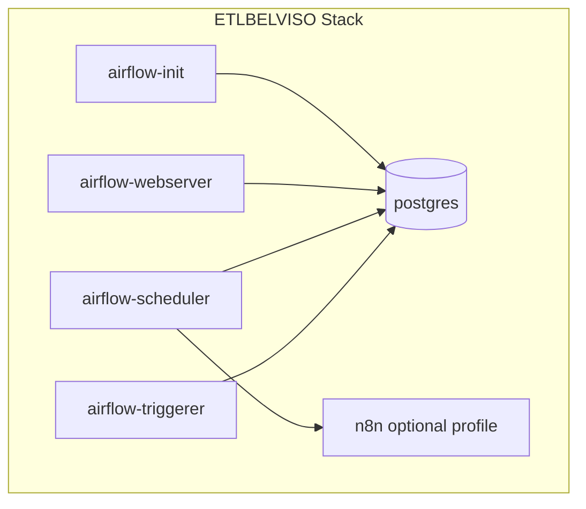

# Architecture Overview

Questo documento descrive l'architettura tecnica corrente del prodotto ETLBELVISO.

## Componenti principali
- Airflow Webserver: UI/API e gestione DAG.
- Airflow Scheduler: scheduling e orchestrazione task.
- Airflow Triggerer: supporto task/eventi asincroni.
- Postgres: metadata DB di Airflow.
- Core module (`core/`): loader config, validazione schema, DAG factory.
- Orchestration config (`config/orchestration/pipelines.yaml`): definizione pipeline dichiarativa.
- n8n (opzionale): integrazione webhook/API per automazioni esterne.

## Vista logica

## Vista deploy (docker compose)

## Decisioni architetturali
- Config-driven first: la topologia pipeline vive nel YAML.
- Validazione upfront: niente DAG generati da config invalida.
- Task type limitati (`bash`, `python`, `http`) per mantenere controllo.
- Master orchestrator separato per trigger coordinati tra pipeline.
- Integrazione n8n come edge di automazione, non come core execution engine.

## Vendor Lock-in Zero e Portabilità Cloud
Essendo costruito su fondamenta **Open Source Puro** (Apache Airflow per l'orchestrazione, PostgreSQL per i metadati, Python per l'esecuzione, containerizzato su Docker), il motore ETL-HALE-BOPP è **Cloud-Agnostic** per definizione.
Non lega l'architettura a servizi proprietari (come Azure Data Factory o AWS Glue). Questo garantisce 3 scenari operativi senza cambiare una riga di codice:
1. **IaaS (Lift-and-Shift)**: Replicabile su qualsiasi Virtual Machine Linux (AWS EC2, Google Compute Engine, on-premise) semplicemente portando file YAML e script Docker.
2. **CaaS (Kubernetes)**: Perfettamente scalabile su cluster GKE, EKS o AKS tramite Helm Charts ufficiali che separano Scheduler e Worker.
3. **PaaS (Managed Services)**: La logica di business (YAML e i "LEGO Blocks" Python in `prebuilt.py`) può essere iniettata intatta in servizi completamente gestiti offerti dai vendor, quali **Google Cloud Composer** o **Amazon MWAA**, delegando a loro la manutenzione dell'infrastruttura ma mantenendo il possesso intellettuale dell'architettura.

## Estensioni consigliate
- Aggiungere task plugin `sql` e `spark` con interfacce tipizzate.
- Introdurre schema JSON ufficiale versione `v1` per i YAML.
- Aggiungere osservabilità (metriche run, latency, error rates).
- Rendere i callback n8n idempotenti con `correlation_id`.
