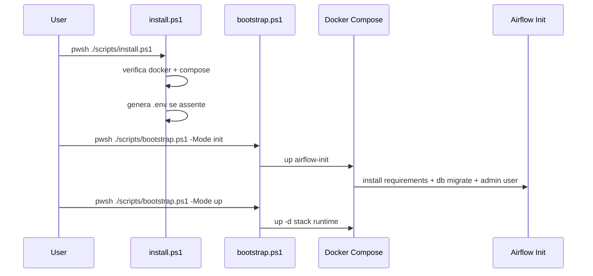
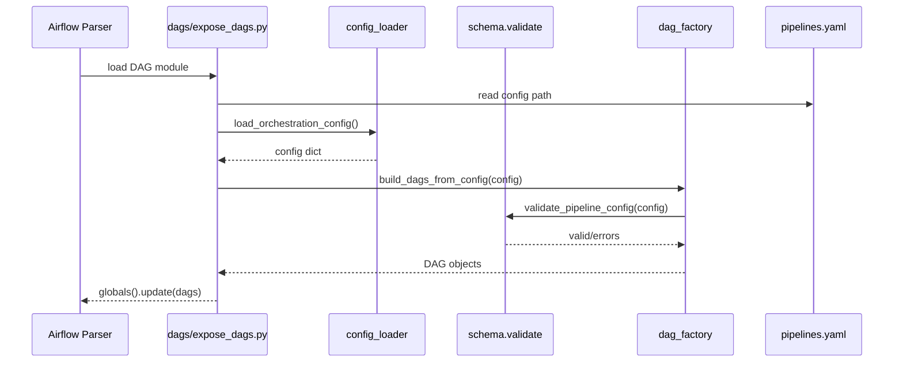
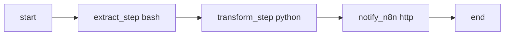
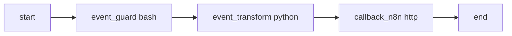
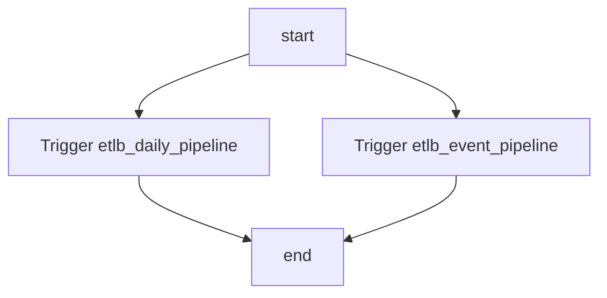
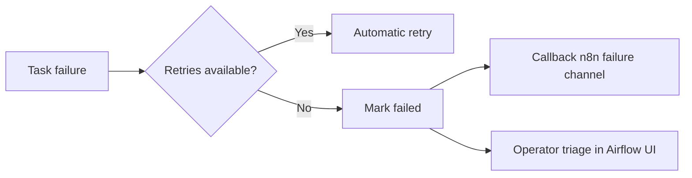

# Flow Design

Documento di disegno dei flow operativi e funzionali.

## 1) Bootstrapping e installazione


## 2) DAG generation flow (config-driven)


## 3) Runtime flow: daily pipeline


## 4) Runtime flow: event pipeline


## 5) Master orchestration flow


## 6) Integrazione n8n (target)
- Airflow -> n8n: callback via `SimpleHttpOperator` con connessione `n8n_default`.
- n8n -> Airflow: trigger DAG via Airflow REST API.
- Contratto payload consigliato:

```json
{
  "correlation_id": "uuid",
  "pipeline": "etlb_daily_pipeline",
  "status": "completed|failed",
  "run_id": "airflow_run_id",
  "timestamp": "ISO-8601"
}
```

## 7) Failure and recovery flow

